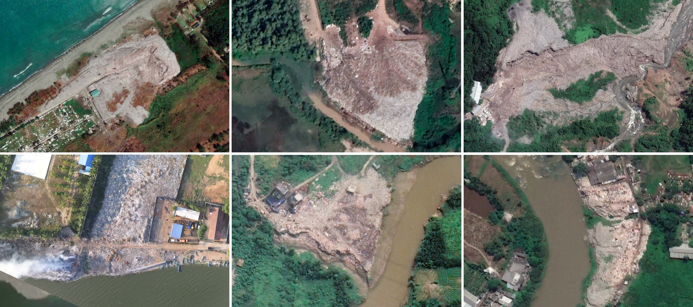

# Detecting and Monitoring Plastic Waste Aggregations in Sentinel-2 Imagery

[Explore the Data](https://plastic.watch.earthrise.media/). [Read an overview of the project](https://gpw.earthrise.media/). [Read a paper detailing the work](https://example.com)


## Project Structure
There are three core domains in this repo: Model Training, Site Detection, and Metadata Generation and Site Monitoring. Reference the [GPW Pipeline Diagram](./assets/GPW%20Diagrams%20-%20Full%20Pipeline%20Stacked.pdf) for information on how pipeline components are related. These scripts are run through a series of notebooks.

### Setup

The code is known to run on Python >= 3.7
```
$ python -m venv env
$ source env/bin/activate
$ pip install -r requirements.txt
```

Imports are given relative to the repo base directory, which therefore must be on PYTHONPATH. Either in your .bash_profile or at the end of the file env/bin/activate add: `export PYTHONPATH=/path/to/plastics:$PYTHONPATH`

The bulk-processing pipeline runs on Descartes Labs. Authorization on your local is handled via the command line helper function: 
`$ descarteslabs auth login` 
Follow the link to enter user email and password. If needed, see [further instructions](https://docs.descarteslabs.com/authentication.html) from Descartes.

### Model Training
1. Create pixel and patch Dataset. [`create_spectrogram_dataset.ipynb`](notebooks/create_spectrogram_dataset.ipynb)
2. Train pixel classifier. [`train_spectrogram_classifier.ipynb`](notebooks/train_spectrogram_classifier.ipynb)
3. Train weakly-labeled patch classifier. [`train patch classifier.ipynb`](notebooks/Train%20Patch%20Classifier%20Weak%20Labeling%20-%20Ensemble,%20SVM,%201px,%20LARGE.ipynb)

The outputs of model training are a temporal pixel and a patch classifier. These are stored in the [models](models) directory.

### Site Detection
1. Generate population-limited area. [`generate_populated_dltiles.ipynb`](notebooks/generate_populated_dltiles.ipynb)
2. Deploy pixel + patch classifier inference on Descartes. [`descartes_spectrogram_run_withpop.ipynb`](notebooks/descartes_spectrogram_run_withpop.ipynb)
3. Detect candidates on Descartes. [`descartes_candidate_detect.ipynb`](notebooks/descartes_candidate_detect.ipynb)
4. Filter pixel candidates by patch classifier intersection. [`query_patch_classifier.ipynb`](notebooks/query_patch_classifier.ipynb)

The end product of this site detection flow is a set of intersection candidate points stored in the [`candidate_sites/{model_version}`](data/model_outputs/candidate_sites/) directory. These sites are then manually validated, and saved in the [`sampling_locations`](data/sampling_locations) directory.

### Metadata and Monitoring
1. Generate metadata for confirmed sites. [`generate_metadata.ipynb`](notebooks/generate_metadata.ipynb)
2. Generate contours for confirmed sites on Descartes. [`descartes_contour_run.ipynb`](notebooks/descartes_contour_run.ipynb)

These outputs are pushed directly to the API and are not stored locally.
