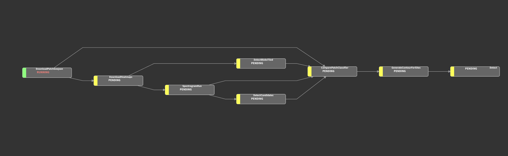

# Dection workflow
This directory has been refactored to be completely standalone and does not rely on any other code (or files) in this
repo. Any previous dependencies have been moved to S3. 

The idea is to formalize the detection workflow in a portable and reproducible framework. 


## Portable workflow
This sub-project is an effort to move from python notebooks to a more portable and stable workflow that allows us to 
simply pass parameters in without worrying about our environment or file system. To accomplish this we're using 
AWS (S3 storage specifically), Luigi and Docker. 

Basics: 
 - All files are stored on S3 
 - Some files, which are needed locally on occasion (things like Tensorflow models), will be downloaded to `/tmp` but should not be considered authoritative
 - The output of every task is written to S3
 - The state of the workflow can be determined by the existence of output from each task in S3
 - Given that Luigi considers a task execution to be identical if executed with identical parameters
   - You must delete files on S3 to rerun a task unless you change parameters
   - If you only delete *some* files Luigi will try to only rerun Tasks associated with the missing output
 

The workflow essentially goes like this:
1. Generate a unique ID based on a hash of the parameters (can be overridden). This serves as the base folder for all other artifacts generated during this run
2. Look at the provided parameters and download necessary artifacts (e.g. models) that need to be provided to Descartes
3. Kick off the Descartes run, find their internal run id and save it to S3
4. Check the status of the run (harder than it should be) and detect when Descartes has finished processing - saving the patch_geojson file to S3.
5. Save the heatmaps to S3
6. Execute blob detection on heatmaps 
7. Compare detections and create a final list of candidate sites
8. Generate contours for each candidate
9. GeoCode sites and enhance metadata
10. Setup Preview environment (*tbd*)



## Components
### Luigi 
Luigi is a workflow management tool that can ensure execution of a task, and it's dependencies, in the proper order. 
More about luigi can be found [here](https://github.com/spotify/luigi)

### Docker

By building a container with all the needed libraries and code we are able to run the detection pipeline
anywhere -- and eventually in an automated or batch fashion. 

## Building 

You should be able to build the docker container only using docker, python not required 
The docker container is based on the `tensorflow:2.6.0-gpu` image and seems to work well on both CPU and GPU machines 

## Running 

The main entrypoint into the workflow is through the `Detect` task, although it is possible to execute any number of its subtasks directly too. 
The `Detect` task exposes the following parameters and defaults:


- `run_id`: a unique id for this run, used as the directory on S3 to hold the output structure. You ***rarely*** should need to set this 
- `start_date`: start date  
- `end_date`: end date 
- `model`: = the ***file name*** of the model not the absolute path, default is `spectrogram_v0.0.11_2021-07-13.h5`  
- `roi`: = the name of the roi ***not*** the file name or path, default is `test_patch`
- `patch_model`: the file name of the patch model (not the path), default is  `v1.1_weak_labels_28x28x24.h5`
- `ensemble_model` = the name (folder name) of the ensemble model -- all h5 files in the folder will be loaded, default is `v0.0.11_ensemble-8-25-21`
- `rect_width`: rectangle width (for windowing *I think*) default is `0.008`
- `mosaic_period` = number of months to mosaic, default is `3`

For example, a very simple detection run over Balie could look like this:

`luigi --module workflows.detect_luigi Detect --roi bali`

### Environment

For obvious security reasons it is bad form to embed sensitive content in code. Therefore, whether running in docker or 
locally there are a few environment variables required: 

AWS (these can be scoped down to only need S3 write to a single bucket):
- `AWS_ACCESS_KEY_ID`
- `AWS_SECRET_ACCESS_KEY`

Descartes: (run `descarteslabs auth env` to generate these)

- `DESCARTESLABS_CLIENT_ID`
- `DESCARTESLABS_CLIENT_SECRET`
- `DESCARTESLABS_REFRESH_TOKEN`


### Locally 
- Recommend a fresh Python 3.7 (conda, venv etc.)
- `pip install -r requirements`
- setup ENV credentials as per above
- add this directory to python path: ```export PYTHONPATH=`pwd` ```
- cross fingers 
- `luigi --module workflows.detect_luigi Detect --roi bali --log-level INFO`

### Docker

The docker image is pushed to GitHub, so you'll first need to authenticate docker to the github registry like so:
1. Go to `https://github.com/settings/tokens` and generate a new token with `read:packages` scope (minimum). 
If you want to also build docker containers and push back up you will need `write:packages` too. 
2. In your terminal run `docker login ghcr.io` and authenticate using your github id and the token generated previously 
3. If auth was successful you should be able to execute `docker pull ghcr.io/earthrise-media/plastics` and pull the container down
4. Create an env file for the required credentials mentioned above
5. Kick off a model run:
   `docker run --env-file docker.env ghcr.io/earthrise-media/plastics --module workflows.detect_luigi Detect --roi bali`
6. Profit!
 